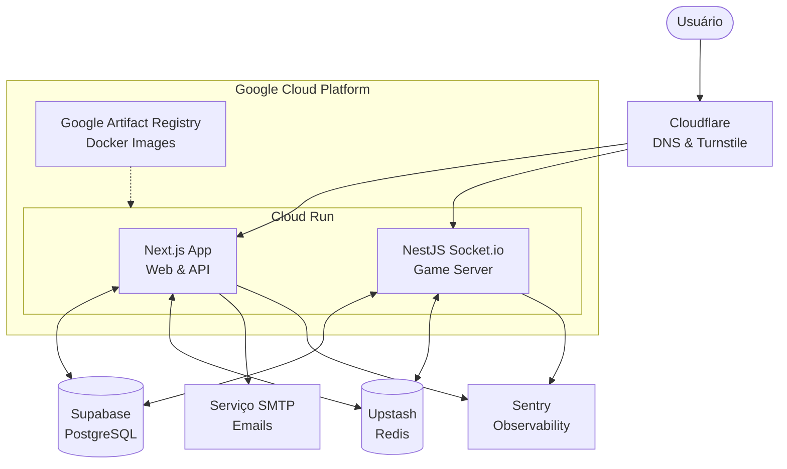

# CogniQuest

CogniQuest é um sistema de quiz multijogador em tempo real projetado com foco em alta performance, resiliência e UX imersivo. Ele permite a criação de lobbys, partidas solo contra a máquina ou em duplas (PvP), com desafios categorizados por matérias e séries escolares.

## 🏗️ Visão Geral da Arquitetura

O projeto utiliza uma arquitetura baseada em microsserviços geridos em um ambiente de **Monorepo** (usando Turborepo e PNPM). Hospedado no **Google Cloud Run** usando containers **Docker**, o sistema isola o servidor web (estateless) do servidor de websockets (stateful) para maximizar a escala e a resiliência.

## 📚 Documentação do Projeto

Abaixo estão os links para a documentação detalhada de cada módulo do sistema:

- **[Arquitetura e Infraestrutura](docs/architecture_and_infra.md)**: Detalhes sobre o uso do Monorepo, separação do Socket.io, Terraform, Docker e escolha das ferramentas principais.
- **[Core Mechanics e Negócio](docs/core_mechanics.md)**: Fluxo do jogo, lógica de criação de sala, uso de cache (Redis) e estrutura do banco de dados.
- **[Segurança e Resiliência](docs/security_and_resilience.md)**: Mitigação de DDoS, Phishing, ataques massivos, segurança de WebSockets e políticas de retry.
- **[Workflow de IA e Regras](docs/ai_workflow_and_rules.md)**: Como as ferramentas de IA (Claude Code, Antigravity Gemini, Google Image Gen) foram orquestradas junto ao sistema de `RULES.md` e `.github/skills`.

## 🛠️ Tecnologias Principais

- **Frontend & API**: Next.js, React, TailwindCSS, Framer Motion.
- **Game Server**: NestJS, Socket.io.
- **Banco de Dados**: Supabase (PostgreSQL), Drizzle ORM.
- **Cache & Rate Limit**: Upstash (Redis).
- **Segurança**: Cloudflare Turnstile, JWT.
- **Infraestrutura**: Google Cloud Run, Terraform, GitHub Actions.
- **Observabilidade**: Sentry.

---
*Gerado durante o desenvolvimento guiado por IA (Antigravity & Claude).*
