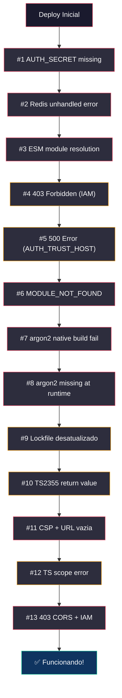

# 🛡️ Relatório de Incidentes — Deploy CogniQuest (Google Cloud Run)

**Data:** 06 de Junho de 2026  
**Ambiente:** Google Cloud Run (us-central1)  
**Projeto:** `project-b2576098-0ce4-47a2-bf7`  
**Serviços:**
- `cogniquest-web` — Frontend Next.js 14
- `cogniquest-game-server` — Backend NestJS + Socket.IO

---

## Resumo Executivo

Durante o deploy inicial do CogniQuest para o Google Cloud Run, foram encontrados **12 erros** em cascata que impediram o funcionamento da aplicação. Os problemas variaram desde configuração de infraestrutura (IAM, CORS) até incompatibilidades de empacotamento (módulos nativos C++, lockfile desatualizado) e bugs de código (escopo TypeScript, CSP restritiva demais).

Todos os erros foram resolvidos em **17 commits** ao longo de uma sessão de ~3 horas.

---

## Cronologia dos Incidentes

### 🔴 Erro #1 — Crash ao iniciar: `AUTH_SECRET is not defined`

| Campo | Detalhe |
|-------|---------|
| **Quando** | Primeira tentativa de deploy |
| **Serviço** | `cogniquest-game-server` |
| **Mensagem** | `FATAL ERROR: AUTH_SECRET is not defined.` |
| **Causa Raiz** | O código exigia `AUTH_SECRET` como variável obrigatória, mas as variáveis de ambiente ainda não tinham sido configuradas no Cloud Run |
| **Solução** | Configuração das variáveis de ambiente no painel do Cloud Run |
| **Commit** | `739a3e8` — Fix initial Cloud Run deployment crash on missing AUTH_SECRET |

---

### 🔴 Erro #2 — Redis sem tratamento de erro

| Campo | Detalhe |
|-------|---------|
| **Quando** | Logo após o Erro #1 |
| **Serviço** | `cogniquest-game-server` |
| **Mensagem** | Container crash sem mensagem clara (Redis connection refused) |
| **Causa Raiz** | O cliente Redis não tinha handler `.on('error')`, fazendo o processo Node.js encerrar com `unhandledRejection` quando não conseguia conectar |
| **Solução** | Adicionado `redis.on('error', ...)` em todos os clientes Redis (pub, sub, db) para capturar erros de conexão sem matar o processo |
| **Commit** | `1ce266e` — Fix Redis unhandled error crashing deployment |

---

### 🔴 Erro #3 — Game-server: resolução de módulos ESM no monorepo

| Campo | Detalhe |
|-------|---------|
| **Quando** | Após o Redis ser corrigido |
| **Serviço** | `cogniquest-game-server` |
| **Mensagem** | `ERR_MODULE_NOT_FOUND` para pacotes internos do workspace (`@cogniquest/auth`, `@cogniquest/db`) |
| **Causa Raiz** | O NestJS usava `nest build` que não resolvia corretamente imports de pacotes `workspace:*` dentro do Docker. Os paths com extensão `.js` (padrão ESM) não eram resolvidos |
| **Solução** | Adicionado Webpack como bundler do game-server (`webpack.config.js`) para empacotar tudo em um único arquivo, e corrigido `tsconfig.json` com `skipLibCheck` e `esModuleInterop` |
| **Commits** | `13100f9`, `80f4051`, `a59156c`, `01d0188` |

---

### 🔴 Erro #4 — 403 Forbidden no site

| Campo | Detalhe |
|-------|---------|
| **Quando** | Primeira vez acessando a URL do Cloud Run |
| **Serviço** | Ambos (`cogniquest-web` e `cogniquest-game-server`) |
| **Mensagem** | `403 Forbidden` no navegador |
| **Causa Raiz** | Por padrão, o Google Cloud Run cria serviços **autenticados** — apenas contas Google com a role `Cloud Run Invoker` podem acessar. Os serviços não estavam configurados como públicos |
| **Solução** | Adicionado `allUsers` como membro com role `roles/run.invoker` via painel do Cloud Run (web) e via `gcloud` CLI (game-server). Posteriormente, adicionado `--allow-unauthenticated` no `deploy.yml` |
| **Commits** | `292fc64` — Add `--allow-unauthenticated` in deploy |

---

### 🔴 Erro #5 — 500 Internal Server Error (NextAuth)

| Campo | Detalhe |
|-------|---------|
| **Quando** | Após liberar o acesso público |
| **Serviço** | `cogniquest-web` |
| **Mensagem** | `500 Internal Server Error` em todas as páginas |
| **Causa Raiz** | O NextAuth (Auth.js) detecta que está rodando atrás de um proxy (Cloud Run) e, sem a variável `AUTH_TRUST_HOST=true`, recusa processar requests por considerar que é um ataque de host-header |
| **Solução** | Adicionada variável de ambiente `AUTH_TRUST_HOST=true` no serviço `cogniquest-web` do Cloud Run |
| **Tipo** | Configuração de infraestrutura |

---

### 🔴 Erro #6 — `MODULE_NOT_FOUND` em runtime (postgres, ioredis, nodemailer)

| Campo | Detalhe |
|-------|---------|
| **Quando** | Após corrigir o AUTH_TRUST_HOST |
| **Serviço** | `cogniquest-web` |
| **Mensagem** | `Error: Cannot find module 'postgres'` (e `ioredis`, `nodemailer`) |
| **Causa Raiz** | No `next.config.mjs`, esses pacotes estavam listados em `config.externals.push(...)` e `serverComponentsExternalPackages`, instruindo o Webpack a NÃO incluí-los no bundle. O modo `output: "standalone"` do Next.js não os traceava corretamente, e eles ficavam de fora da imagem Docker |
| **Solução** | Removidos `ioredis`, `postgres` e `nodemailer` do array de externals, forçando o Webpack a empacotá-los no bundle final |
| **Commit** | `73f7ca6` — Fix MODULE_NOT_FOUND by bundling backend packages in Next.js |

**Arquivo modificado:** [next.config.mjs](file:///c:/Users/gabri/prj/CogniQuest/apps/web/next.config.mjs)

---

### 🔴 Erro #7 — `No native build found for platform=linux` (argon2)

| Campo | Detalhe |
|-------|---------|
| **Quando** | Imediatamente após o Erro #6 |
| **Serviço** | `cogniquest-web` |
| **Mensagem** | `Error: No native build was found for platform=linux arch=x64 runtime=node abi=115 uv=1 libc=glibc node=20.20.2 webpack=true` |
| **Causa Raiz** | O `argon2` é um pacote de criptografia escrito em **C++ nativo** (não JavaScript). Quando o Webpack tentou empacotá-lo (após remover dos externals no Erro #6), falhou porque não consegue compilar código C++ |
| **Solução Intermediária** | Restaurado `argon2` nos externals → resolveu o build, mas criou o Erro #8 |
| **Solução Definitiva** | **Substituição completa do `argon2` pelo `bcryptjs`** — uma biblioteca de hashing de senhas 100% JavaScript puro, sem dependências nativas |
| **Commits** | `1a4adae` (intermediário), `f7609d4` (definitivo) |

**Arquivo modificado:** [password.ts](file:///c:/Users/gabri/prj/CogniQuest/packages/auth/src/password.ts)

> [!IMPORTANT]
> A troca de `argon2` para `bcryptjs` é segura porque o banco de dados estava vazio (nenhum usuário cadastrado com hash argon2). Se houvesse usuários existentes, seria necessário uma migração gradual dos hashes.

---

### 🔴 Erro #8 — `Cannot find module 'argon2'` em runtime

| Campo | Detalhe |
|-------|---------|
| **Quando** | Deploy após o Erro #7 (solução intermediária) |
| **Serviço** | `cogniquest-web` |
| **Mensagem** | `⨯ Error: Cannot find module 'argon2'` |
| **Causa Raiz** | O `argon2` foi marcado como external (não empacotado pelo Webpack), mas o modo standalone do Next.js não incluiu o pacote no diretório final da imagem Docker. Resultado: build OK, mas runtime crash |
| **Solução** | Resolvido pelo Erro #7 (solução definitiva) — eliminação total do argon2 do projeto |
| **Commit** | `f7609d4` |

---

### 🔴 Erro #9 — `ERR_PNPM_OUTDATED_LOCKFILE`

| Campo | Detalhe |
|-------|---------|
| **Quando** | Build na esteira CI/CD (GitHub Actions) |
| **Serviço** | Docker build do `cogniquest-web` |
| **Mensagem** | `Cannot install with "frozen-lockfile" because pnpm-lock.yaml is not up to date with packages/db/package.json` |
| **Causa Raiz** | O `packages/db/package.json` tinha sido atualizado (versão do Drizzle ORM) mas o arquivo `package.json` não foi commitado junto com o `pnpm-lock.yaml`. O Docker usa `--frozen-lockfile` por padrão no CI, e rejeitou a instalação |
| **Solução** | Commitados todos os `package.json` pendentes que estavam modificados localmente mas não incluídos no git |
| **Commit** | `482b7dc` — Sync package.jsons and seed fixes with lockfile |

---

### 🔴 Erro #10 — `TS2355: A function must return a value`

| Campo | Detalhe |
|-------|---------|
| **Quando** | Build na esteira CI/CD |
| **Serviço** | `cogniquest-game-server` |
| **Mensagem** | `error TS2355: A function whose declared type is neither 'undefined', 'void', nor 'any' must return a value.` — na função `needsRehash` |
| **Causa Raiz** | Ao substituir `argon2` por `bcryptjs`, a função `needsRehash(hash: string): boolean` ficou com o corpo vazio (a chamada `argon2.needsRehash()` foi removida mas nenhum `return` foi adicionado) |
| **Solução** | Adicionado `return false;` no corpo da função |
| **Commit** | `ce4d94e` — Fix TS compilation error in password.ts |

**Arquivo modificado:** [password.ts](file:///c:/Users/gabri/prj/CogniQuest/packages/auth/src/password.ts)

---

### 🔴 Erro #11 — CSP bloqueando Socket.IO + URL do game-server vazia

| Campo | Detalhe |
|-------|---------|
| **Quando** | Após o site carregar com sucesso pela primeira vez |
| **Serviço** | `cogniquest-web` (browser-side) |
| **Mensagem** | `Connecting to '<URL>' violates the following Content Security Policy directive: "connect-src 'self' ..."` + Socket.IO fazendo polling no domínio errado (frontend ao invés do game-server) |
| **Causa Raiz** | **Dois problemas simultâneos:** (1) A CSP no middleware bloqueava conexões socket.io; (2) `window.__ENV.GAME_SERVER_URL` chegava vazia no browser porque o Next.js standalone nem sempre expõe `process.env` no runtime do layout |
| **Solução** | (1) CSP desativada temporariamente; (2) Criada API route `/api/config` que retorna a URL do game-server via `process.env` do servidor; (3) Reescrito `socket.ts` para buscar a URL via fetch antes de conectar |
| **Commits** | `988d67c`, `d4739e0` |

**Arquivos criados/modificados:**
- [/api/config/route.ts](file:///c:/Users/gabri/prj/CogniQuest/apps/web/src/app/api/config/route.ts) — **Novo**
- [socket.ts](file:///c:/Users/gabri/prj/CogniQuest/apps/web/src/lib/socket.ts) — Reescrito
- [middleware.ts](file:///c:/Users/gabri/prj/CogniQuest/apps/web/src/middleware.ts) — CSP removida

---

### 🔴 Erro #12 — `Cannot find name 's'` (escopo TypeScript)

| Campo | Detalhe |
|-------|---------|
| **Quando** | Build na esteira CI/CD |
| **Serviço** | `cogniquest-web` |
| **Mensagem** | `Type error: Cannot find name 's'.` no `useGameSocket.ts` |
| **Causa Raiz** | Ao converter o `useEffect` para usar `initSocket` (async), a variável `s` (socket) foi declarada dentro de uma IIFE assíncrona `(async () => { const s = ... })()`, mas a função de cleanup do `useEffect` (`return () => { s.off(...) }`) tentava acessá-la fora desse escopo |
| **Solução** | Substituído o cleanup manual por `disconnectSocket()` (função exportada do módulo que gerencia o singleton do socket) |
| **Commit** | `d95410b` |

**Arquivo modificado:** [useGameSocket.ts](file:///c:/Users/gabri/prj/CogniQuest/apps/web/src/hooks/useGameSocket.ts)

---

### 🔴 Erro #13 — 403 Forbidden no Socket.IO (CORS + IAM)

| Campo | Detalhe |
|-------|---------|
| **Quando** | Após todos os fixes de build, ao tentar criar sala no lobby |
| **Serviço** | `cogniquest-game-server` |
| **Mensagem** | `Access to XMLHttpRequest at 'https://cogniquest-game-server-...' from origin 'https://cogniquest-web-...' has been blocked by CORS policy: No 'Access-Control-Allow-Origin' header is present` |
| **Causa Raiz** | **Dois problemas:** (1) O serviço `cogniquest-game-server` no Cloud Run NÃO estava com acesso público (`allUsers` como Invoker nunca foi configurado para o backend); (2) O Socket.IO adapter (`createIOServer`) não passava opções de CORS ao criar o servidor |
| **Solução** | (1) Executado `gcloud run services add-iam-policy-binding cogniquest-game-server --member=allUsers --role=roles/run.invoker` (efeito imediato); (2) Adicionado `cors: { origin, credentials }` no `createIOServer` do adapter; (3) Adicionado `flags: '--allow-unauthenticated'` no `deploy.yml` para futuros deploys |
| **Commit** | `292fc64` |

**Arquivos modificados:**
- [main.ts](file:///c:/Users/gabri/prj/CogniQuest/apps/game-server/src/main.ts) — CORS no Socket.IO adapter
- [deploy.yml](file:///c:/Users/gabri/prj/CogniQuest/.github/workflows/deploy.yml) — `--allow-unauthenticated`

---

## Resumo Visual dos Erros

---

## Categorização dos Erros

| Categoria | Erros | Quantidade |
|-----------|-------|------------|
| 🏗️ Infraestrutura (IAM, Cloud Run) | #1, #4, #5, #13 | 4 |
| 📦 Empacotamento (Webpack, Docker, Standalone) | #3, #6, #7, #8, #9 | 5 |
| 🔒 Segurança (CSP, CORS) | #11, #13 | 2 |
| 💻 Código (TypeScript, lógica) | #2, #10, #12 | 3 |

---

## Lições Aprendidas

> [!TIP]
> ### 1. Módulos nativos (C++) são incompatíveis com o modo Standalone do Next.js
> Pacotes como `argon2` que dependem de binários compilados em C++ não funcionam bem com `output: "standalone"` + Docker. Prefira alternativas em JavaScript puro como `bcryptjs`.

> [!TIP]
> ### 2. Sempre use `--allow-unauthenticated` no deploy do Cloud Run para apps web
> Por padrão, o Cloud Run exige autenticação Google IAM. Para sites públicos, é obrigatório configurar acesso público, seja pelo painel ou via flag no deploy.

> [!TIP]
> ### 3. `AUTH_TRUST_HOST=true` é obrigatório para NextAuth fora da Vercel
> Quando o Next.js roda atrás de um proxy (Cloud Run, AWS, etc.), o NextAuth precisa dessa variável para confiar no host header do proxy.

> [!TIP]
> ### 4. CSP deve ser ativada incrementalmente
> Uma CSP restritiva demais pode bloquear funcionalidades essenciais (WebSocket, polling). É melhor começar sem CSP e adicionar diretivas gradualmente.

> [!TIP]
> ### 5. Variáveis de ambiente em Next.js Standalone precisam de mecanismo explícito
> `process.env` não é garantido no runtime do cliente em modo standalone. Use API routes (`/api/config`) para expor configurações do servidor ao browser.

> [!TIP]
> ### 6. Sempre commit `package.json` junto com `pnpm-lock.yaml`
> O `--frozen-lockfile` do CI rejeita instalações quando os dois arquivos estão desincronizados.

---

## Lista de Commits (Ordem Cronológica)

| # | Hash | Descrição |
|---|------|-----------|
| 1 | `76d627d` | Trigger initial Cloud Run deployment |
| 2 | `739a3e8` | Fix initial Cloud Run deployment crash on missing AUTH_SECRET |
| 3 | `1ce266e` | Fix Redis unhandled error crashing deployment |
| 4 | `13100f9` | Fix game-server runtime module resolution by bundling with Webpack |
| 5 | `80f4051` | Fix game-server tsconfig missing skipLibCheck and esModuleInterop |
| 6 | `a59156c` | Fix Docker builds missing tsconfig.base.json after turbo prune |
| 7 | `01d0188` | Use tsx directly for game-server production |
| 8 | `7fed5de` | Dynamically read GAME_SERVER_URL at request time |
| 9 | `28cd1f8` | Restore strict environment variable checks in production |
| 10 | `73f7ca6` | Fix MODULE_NOT_FOUND by bundling backend packages in Next.js |
| 11 | `1a4adae` | Keep argon2 external in Next.js to prevent native module build errors |
| 12 | `f7609d4` | Replace native argon2 with pure JS bcryptjs |
| 13 | `482b7dc` | Sync package.jsons and seed fixes with lockfile |
| 14 | `ce4d94e` | Fix TS compilation error in password.ts |
| 15 | `988d67c` | Fix CSP connect-src and game server URL injection |
| 16 | `d4739e0` | Disable CSP, add /api/config endpoint, async URL resolution |
| 17 | `d95410b` | Fix variable scope in useGameSocket cleanup |
| 18 | `292fc64` | Add CORS to Socket.IO adapter + auto-allow-unauthenticated |

---

## Estado Final

✅ **cogniquest-web** — Online e funcional  
✅ **cogniquest-game-server** — Online, Socket.IO respondendo (200/101)  
✅ **CORS** — Headers corretos (`Access-Control-Allow-Origin` + `credentials`)  
✅ **IAM** — Ambos os serviços públicos com `allUsers` Invoker  
✅ **WebSocket** — Upgrade HTTP→WS (101) confirmado nos logs  
⚠️ **CSP** — Temporariamente desativada (reativar após estabilização)  
⚠️ **Cold Start** — Primeira requisição socket.io pode dar 502 (comportamento esperado do Cloud Run com min_instances=0)
